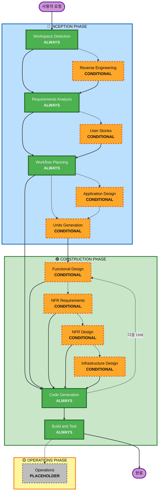

# AI-DLC Adaptive Workflow Overview

**Purpose**: AI 모델과 개발자가 전체 워크플로 구조를 이해하기 위한 기술 참조입니다.

**Note**: 유사한 내용이 welcome-message.md(사용자 welcome message)와 README.md(문서)에도 있습니다. 이 중복은 의도된 것입니다. 각 파일은 서로 다른 목적을 가집니다.

- **This file**: AI 모델 context loading을 위한 Mermaid diagram 포함 상세 기술 참조
- **welcome-message.md**: ASCII diagram이 포함된 사용자 대상 welcome message
- **README.md**: 저장소용 사람이 읽기 쉬운 문서

## The Three-Phase Lifecycle:

• **INCEPTION PHASE**: 계획 및 아키텍처(Workspace Detection + conditional phases + Workflow Planning)
• **CONSTRUCTION PHASE**: 설계, 구현, build and test(per-unit design + Code Generation + Build & Test)
• **OPERATIONS PHASE**: 향후 deployment 및 monitoring workflow를 위한 placeholder

## The Adaptive Workflow:

• **Workspace Detection**(항상) → **Reverse Engineering**(brownfield only) → **Requirements Analysis**(항상, adaptive depth) → **Conditional Phases**(필요 시) → **Workflow Planning**(항상) → **Code Generation**(항상, per-unit) → **Build and Test**(항상)

## How It Works:

• **AI analyzes**: 요청, workspace, 복잡도를 분석해 필요한 stage를 결정합니다.
• **These stages always execute**: Workspace Detection, Requirements Analysis(adaptive depth), Workflow Planning, Code Generation(per-unit), Build and Test
• **All other stages are conditional**: Reverse Engineering, User Stories, Application Design, Units Generation, per-unit design stages(Functional Design, NFR Requirements, NFR Design, Infrastructure Design)
• **No fixed sequences**: stage는 특정 작업에 가장 적합한 순서로 실행됩니다.

## Your Team's Role:

• **Answer questions**: 전용 question file에서 [Answer]: tags와 letter choices(A, B, C, D, E)를 사용해 답변합니다.
• **Option E available**: 제공된 선택지가 맞지 않으면 "Other"를 선택하고 custom response를 설명합니다.
• **Work as a team**: 진행 전에 각 phase를 검토하고 승인합니다.
• **Collectively decide**: 필요한 경우 architectural approach를 함께 결정합니다.
• **Important**: 이 과정은 team effort입니다. 각 phase에 관련 stakeholder를 참여시키세요.

## AI-DLC Three-Phase Workflow:

**Stage Descriptions:**

**🔵 INCEPTION PHASE** - 계획 및 아키텍처

- Workspace Detection: workspace 상태와 project type을 분석합니다(ALWAYS).
- Reverse Engineering: 기존 코드베이스를 분석합니다(CONDITIONAL - Brownfield only).
- Requirements Analysis: requirements를 수집하고 검증합니다(ALWAYS - Adaptive depth).
- User Stories: user stories와 personas를 작성합니다(CONDITIONAL).
- Workflow Planning: execution plan을 작성합니다(ALWAYS).
- Application Design: high-level component 식별 및 service layer design(CONDITIONAL)
- Units Generation: units of work로 분해합니다(CONDITIONAL).

**🟢 CONSTRUCTION PHASE** - 설계, 구현, Build and Test

- Functional Design: unit별 상세 business logic design(CONDITIONAL, per-unit)
- NFR Requirements: NFR을 결정하고 tech stack을 선택합니다(CONDITIONAL, per-unit).
- NFR Design: NFR pattern과 logical component를 반영합니다(CONDITIONAL, per-unit).
- Infrastructure Design: 실제 infrastructure service로 mapping합니다(CONDITIONAL, per-unit).
- Code Generation: Part 1 - Planning, Part 2 - Generation으로 code를 생성합니다(ALWAYS, per-unit).
- Build and Test: 모든 unit을 build하고 종합 testing을 실행합니다(ALWAYS).

**🟡 OPERATIONS PHASE** - Placeholder

- Operations: 향후 deployment 및 monitoring workflow를 위한 placeholder입니다(PLACEHOLDER).

**Key Principles:**

- phase는 가치를 더할 때만 실행합니다.
- 각 phase는 독립적으로 평가됩니다.
- INCEPTION은 "what"과 "why"에 집중합니다.
- CONSTRUCTION은 "how"와 "build and test"에 집중합니다.
- OPERATIONS는 향후 확장을 위한 placeholder입니다.
- 단순 변경은 conditional INCEPTION stage를 건너뛸 수 있습니다.
- 복잡한 변경은 INCEPTION과 CONSTRUCTION을 완전하게 거칩니다.
