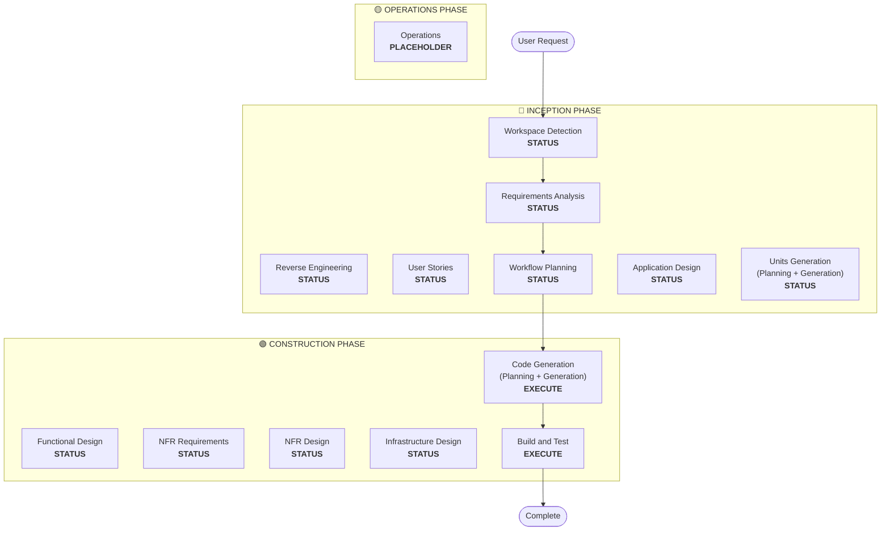

# Workflow Planning

**목적**: 어떤 단계를 실행할지 결정하고 종합적인 실행 계획을 작성합니다.

**Always Execute**: 이 단계는 요구사항과 범위를 이해한 뒤 항상 실행됩니다.

## Step 1: 이전 컨텍스트 모두 로드

### 1.1 리버스 엔지니어링 아티팩트 로드 (brownfield인 경우)
- architecture.md
- component-inventory.md
- technology-stack.md
- dependencies.md

### 1.2 Requirements Analysis 로드
- requirements.md (intent analysis 포함)
- requirement-verification-questions.md (답변 포함)

### 1.3 User Stories 로드 (실행되었다면)
- stories.md
- personas.md

## Step 2: 상세 범위 및 영향 분석

**이제 완전한 컨텍스트(요구사항 + 스토리)가 있으니, 상세 분석을 수행합니다:**

### 2.1 변환 범위 감지 (Brownfield 전용)

**brownfield 프로젝트라면** 변환 범위를 분석합니다:

#### 아키텍처 변환
- **단일 컴포넌트 변경** vs **아키텍처 변환**
- **인프라 변경** vs **애플리케이션 변경**
- **배포 모델 변경** (Lambda→Container, EC2→Serverless 등)

#### 관련 컴포넌트 식별
변환의 경우, 다음을 식별:
- **인프라 코드** (업데이트 필요)
- **CDK 스택** (변경 필요)
- **API Gateway** 설정
- **로드 밸런서** 요구사항
- **네트워킹** 변경
- **모니터링/로깅** 적응

#### 패키지 간 영향
- **CDK 인프라** 패키지 (업데이트 필요)
- **공유 모델** (버전 업데이트 필요)
- **클라이언트 라이브러리** (엔드포인트 변경 필요)
- **테스트 패키지** (새 테스트 시나리오 필요)

### 2.2 변경 영향 평가

#### 영향 영역
1. **User-facing changes**: 사용자 경험에 영향을 주는가?
2. **Structural changes**: 시스템 아키텍처를 변경하는가?
3. **Data model changes**: DB 스키마/데이터 구조에 영향을 주는가?
4. **API changes**: 인터페이스/계약에 영향을 주는가?
5. **NFR impact**: 성능/보안/확장성에 영향을 주는가?

#### Application 레이어 영향 (해당 시)
- **Code changes**: 새 진입점, 어댑터, 설정
- **Dependencies**: 새 라이브러리, 프레임워크 변경
- **Configuration**: 환경 변수, 설정 파일
- **Testing**: 유닛 테스트, 통합 테스트

#### Infrastructure 레이어 영향 (해당 시)
- **Deployment model**: Lambda→ECS, EC2→Fargate 등
- **Networking**: VPC, 보안 그룹, 로드 밸런서
- **Storage**: 영속 볼륨, 공유 스토리지
- **Scaling**: 오토스케일링 정책, 용량 계획

#### Operations 레이어 영향 (해당 시)
- **Monitoring**: CloudWatch, 커스텀 메트릭, 대시보드
- **Logging**: 로그 집계, 구조화 로깅
- **Alerting**: 알람 설정, 알림 채널
- **Deployment**: CI/CD 파이프라인 변경, 롤백 전략

### 2.3 컴포넌트 관계 매핑 (Brownfield 전용)

**brownfield 프로젝트라면** 컴포넌트 의존 그래프를 작성합니다:

```markdown
## Component Relationships
- **Primary Component**: [변경되는 패키지]
- **Infrastructure Components**: [CDK/Terraform 패키지]
- **Shared Components**: [모델, 유틸리티, 클라이언트]
- **Dependent Components**: [이 컴포넌트를 호출하는 서비스]
- **Supporting Components**: [모니터링, 로깅, 배포]
```

각 관련 컴포넌트에 대해:
- **Change Type**: Major, Minor, Configuration-only
- **Change Reason**: 직접 의존성, 배포 모델, 네트워킹
- **Change Priority**: Critical, Important, Optional

### 2.4 리스크 평가

리스크 수준 평가:
1. **Low**: 고립된 변경, 쉬운 롤백, 잘 이해됨
2. **Medium**: 여러 컴포넌트, 중간 수준의 롤백, 일부 미지수
3. **High**: 시스템 전반 영향, 복잡한 롤백, 큰 미지수
4. **Critical**: 프로덕션 핵심, 어려운 롤백, 높은 불확실성

## Step 3: 단계 결정

### 3.1 User Stories - 이미 실행되었나, 건너뛸 것인가?
**이미 실행됨**: 다음 결정으로 이동
**실행되지 않음 - 다음일 때 실행**:
- 여러 사용자 페르소나
- 사용자 경험 영향
- 수락 기준 필요
- 팀 협업 필요

**다음일 때 건너뜀**:
- 내부 리팩터링
- 명확한 재현이 있는 버그 수정
- 기술 부채 감소
- 인프라 변경

### 3.2 Application Design - 다음일 때 실행:
- 새 컴포넌트/서비스 필요
- 컴포넌트 메서드/비즈니스 룰 정의 필요
- 서비스 레이어 설계 필요
- 컴포넌트 의존성 명확화 필요

**다음일 때 건너뜀**:
- 기존 컴포넌트 경계 내 변경
- 새 컴포넌트/메서드 없음
- 순수 구현 변경

### 3.3 Units Generation - 다음일 때 실행:
- 새 데이터 모델/스키마
- API 변경/새 엔드포인트
- 복잡한 알고리즘/비즈니스 로직
- 상태 관리 변경
- 여러 패키지 변경 필요
- IaC 업데이트 필요

**다음일 때 건너뜀**:
- 단순 로직 변경
- UI만의 변경
- 설정 업데이트
- 직관적인 구현

### 3.4 NFR Implementation - 다음일 때 실행:
- 성능 요구사항
- 보안 고려사항
- 확장성 우려
- 모니터링/옵저버빌리티 필요

**다음일 때 건너뜀**:
- 기존 NFR 셋업으로 충분
- 새 NFR 요구사항 없음
- NFR 영향이 없는 단순 변경

## Step 4: 적응형 세부 안내

**적응형 깊이 설명은 [depth-levels.md](../common/depth-levels.md) 참고.**

실행될 각 스테이지에 대해:
- 정의된 모든 아티팩트가 생성됩니다.
- 아티팩트 내 세부 수준은 문제 복잡도에 적응합니다.
- 모델이 문제 특성을 기반으로 적절한 세부를 결정합니다.

## Step 5: 다중 모듈 조율 분석 (Brownfield 전용)

**여러 모듈/패키지를 가진 brownfield라면** 의존성을 분석하고 최적 업데이트 전략을 결정:

### 5.1 모듈 의존성 분석
- 빌드 시스템 의존성과 매니페스트 검토
- 빌드 타임 vs 런타임 의존성 식별
- 모듈 간 API 계약과 공유 인터페이스 매핑

### 5.2 업데이트 전략 결정
의존성 분석을 기반으로 다음을 결정:
- **Update sequence**: 의존성 때문에 먼저 업데이트해야 하는 모듈
- **Parallelization opportunities**: 동시에 업데이트할 수 있는 모듈
- **Coordination requirements**: 버전 호환성, API 계약, 배포 순서
- **Testing strategy**: 모듈별 vs 통합 테스팅 접근
- **Rollback strategy**: 중간 실패 시 복구 계획

### 5.3 조율 계획 문서화
```markdown
## Module Update Strategy
- **Update Approach**: [Sequential/Parallel/Hybrid]
- **Critical Path**: [다른 업데이트를 막는 모듈]
- **Coordination Points**: [공유 API, 인프라, 데이터 계약]
- **Testing Checkpoints**: [통합 검증 시점]
```

영향받는 모듈마다 다음을 식별:
- **Update priority**: 먼저 업데이트 vs 나중 업데이트
- **Dependency constraints**: 무엇에 의존하고, 무엇이 자신에 의존하는지
- **Change scope**: Major(breaking), Minor(compatible), Patch(fixes)

## Step 6: 워크플로우 시각화 생성

다음을 보여주는 Mermaid 플로우차트 생성:
- 모든 단계의 순서
- 조건부 단계마다 EXECUTE / SKIP 결정
- 각 단계 상태에 맞는 스타일링

**스타일링 룰** (플로우차트 뒤에 추가):
```
style WD fill:#4CAF50,stroke:#1B5E20,stroke-width:3px,color:#fff
style CG fill:#4CAF50,stroke:#1B5E20,stroke-width:3px,color:#fff
style BT fill:#4CAF50,stroke:#1B5E20,stroke-width:3px,color:#fff
style US fill:#BDBDBD,stroke:#424242,stroke-width:2px,stroke-dasharray: 5 5,color:#000
style Start fill:#CE93D8,stroke:#6A1B9A,stroke-width:3px,color:#000
style End fill:#CE93D8,stroke:#6A1B9A,stroke-width:3px,color:#000

linkStyle default stroke:#333,stroke-width:2px
```

**스타일 가이드라인**:
- 완료/항상 실행: `fill:#4CAF50,stroke:#1B5E20,stroke-width:3px,color:#fff` (Material Green + 흰색 텍스트)
- 조건부 EXECUTE: `fill:#FFA726,stroke:#E65100,stroke-width:3px,stroke-dasharray: 5 5,color:#000` (Material Orange + 검정 텍스트)
- 조건부 SKIP: `fill:#BDBDBD,stroke:#424242,stroke-width:2px,stroke-dasharray: 5 5,color:#000` (Material Gray + 검정 텍스트)
- Start/End: `fill:#CE93D8,stroke:#6A1B9A,stroke-width:3px,color:#000` (Material Purple + 검정 텍스트)
- Phase 컨테이너: 더 옅은 Material 색상 사용 (INCEPTION: #BBDEFB, CONSTRUCTION: #C8E6C9, OPERATIONS: #FFF59D)

## Step 7: 실행 계획 문서 작성

`aidlc-docs/inception/plans/execution-plan.md` 생성:

```markdown
# Execution Plan

## Detailed Analysis Summary

### Transformation Scope (Brownfield Only)
- **Transformation Type**: [Single component/Architectural/Infrastructure]
- **Primary Changes**: [설명]
- **Related Components**: [목록]

### Change Impact Assessment
- **User-facing changes**: [Yes/No - 설명]
- **Structural changes**: [Yes/No - 설명]
- **Data model changes**: [Yes/No - 설명]
- **API changes**: [Yes/No - 설명]
- **NFR impact**: [Yes/No - 설명]

### Component Relationships (Brownfield Only)
[컴포넌트 의존 그래프]

### Risk Assessment
- **Risk Level**: [Low/Medium/High/Critical]
- **Rollback Complexity**: [Easy/Moderate/Difficult]
- **Testing Complexity**: [Simple/Moderate/Complex]

## Workflow Visualization



**참고**: STATUS 자리표시자를 실제 단계 상태(COMPLETED/SKIP/EXECUTE)로 치환하고 적절한 스타일을 적용하세요.

## Phases to Execute

### 🔵 INCEPTION PHASE
- [x] Workspace Detection (COMPLETED)
- [x] Reverse Engineering (COMPLETED/SKIPPED)
- [x] Requirements Analysis (COMPLETED)
- [x] User Stories (COMPLETED/SKIPPED)
- [x] Execution Plan (IN PROGRESS)
- [ ] Application Design - [EXECUTE/SKIP]
  - **Rationale**: [실행/건너뛰는 이유]
- [ ] Units Generation - [EXECUTE/SKIP]
  - **Rationale**: [실행/건너뛰는 이유]

### 🟢 CONSTRUCTION PHASE
- [ ] Functional Design - [EXECUTE/SKIP]
  - **Rationale**: [실행/건너뛰는 이유]
- [ ] NFR Requirements - [EXECUTE/SKIP]
  - **Rationale**: [실행/건너뛰는 이유]
- [ ] NFR Design - [EXECUTE/SKIP]
  - **Rationale**: [실행/건너뛰는 이유]
- [ ] Infrastructure Design - [EXECUTE/SKIP]
  - **Rationale**: [실행/건너뛰는 이유]
- [ ] Code Generation - EXECUTE (ALWAYS)
  - **Rationale**: 구현 기획과 코드 생성이 필요
- [ ] Build and Test - EXECUTE (ALWAYS)
  - **Rationale**: 빌드, 테스트, 검증이 필요

### 🟡 OPERATIONS PHASE
- [ ] Operations - PLACEHOLDER
  - **Rationale**: 향후 배포·모니터링 워크플로우

## Package Change Sequence (Brownfield Only)
[해당하면 의존성과 함께 패키지 업데이트 순서를 나열]

## Estimated Timeline
- **Total Phases**: [개수]
- **Estimated Duration**: [시간 추정]

## Success Criteria
- **Primary Goal**: [주요 목표]
- **Key Deliverables**: [목록]
- **Quality Gates**: [목록]

[IF brownfield]
- **Integration Testing**: 모든 컴포넌트가 함께 동작
- **Operational Readiness**: 모니터링/로깅/알림 동작
```

## Step 8: 상태 추적 초기화

`aidlc-docs/aidlc-state.md` 업데이트:

```markdown
# AI-DLC State Tracking

## Project Information
- **Project Type**: [Greenfield/Brownfield]
- **Start Date**: [ISO timestamp]
- **Current Stage**: INCEPTION - Workflow Planning

## Execution Plan Summary
- **Total Stages**: [개수]
- **Stages to Execute**: [목록]
- **Stages to Skip**: [사유와 함께 목록]

## Stage Progress

### 🔵 INCEPTION PHASE
- [x] Workspace Detection
- [x] Reverse Engineering (해당 시)
- [x] Requirements Analysis
- [x] User Stories (해당 시)
- [x] Workflow Planning
- [ ] Application Design - [EXECUTE/SKIP]
- [ ] Units Generation - [EXECUTE/SKIP]

### 🟢 CONSTRUCTION PHASE
- [ ] Functional Design - [EXECUTE/SKIP]
- [ ] NFR Requirements - [EXECUTE/SKIP]
- [ ] NFR Design - [EXECUTE/SKIP]
- [ ] Infrastructure Design - [EXECUTE/SKIP]
- [ ] Code Generation - EXECUTE
- [ ] Build and Test - EXECUTE

### 🟡 OPERATIONS PHASE
- [ ] Operations - PLACEHOLDER

## Current Status
- **Lifecycle Phase**: INCEPTION
- **Current Stage**: Workflow Planning Complete
- **Next Stage**: [실행할 다음 스테이지]
- **Status**: Ready to proceed
```

## Step 9: 사용자에게 계획 제시

```markdown
# 📋 Workflow Planning Complete

다음을 기반으로 종합 실행 계획을 작성했습니다:
- 요청: [요약]
- 기존 시스템: [brownfield인 경우 요약]
- 요구사항: [실행되었다면 요약]
- 사용자 스토리: [실행되었다면 요약]

**Detailed Analysis**:
- Risk level: [수준]
- Impact: [핵심 영향 요약]
- Components affected: [목록]

**Recommended Execution Plan**:

[X]개 스테이지 실행을 권장합니다:

🔵 **INCEPTION PHASE:**
1. [Stage name] - *Rationale:* [실행 이유]
2. [Stage name] - *Rationale:* [실행 이유]
...

🟢 **CONSTRUCTION PHASE:**
3. [Stage name] - *Rationale:* [실행 이유]
4. [Stage name] - *Rationale:* [실행 이유]
...

[Y]개 스테이지 건너뛰기를 권장합니다:

🔵 **INCEPTION PHASE:**
1. [Stage name] - *Rationale:* [건너뛰는 이유]
2. [Stage name] - *Rationale:* [건너뛰는 이유]
...

🟢 **CONSTRUCTION PHASE:**
3. [Stage name] - *Rationale:* [건너뛰는 이유]
4. [Stage name] - *Rationale:* [건너뛰는 이유]
...

[IF brownfield with multiple packages]
**Recommended Package Update Sequence**:
1. [Package] - [이유]
2. [Package] - [이유]
...

**Estimated Timeline**: [기간]

> **📋 <u>**REVIEW REQUIRED:**</u>**  
> Please examine the execution plan at: `aidlc-docs/inception/plans/execution-plan.md`

> **🚀 <u>**WHAT'S NEXT?**</u>**
>
> **You may:**
>
> 🔧 **Request Changes** - Ask for modifications to the execution plan if required
> [IF any stages are skipped:]
> 📝 **Add Skipped Stages** - Choose to include stages currently marked as SKIP
> ✅ **Approve & Continue** - Approve plan and proceed to **[Next Stage Name]**
```

## Step 10: 사용자 응답 처리

- **승인되면**: 실행 계획의 다음 스테이지로 진행
- **변경 요청되면**: 실행 계획을 업데이트하고 재확인
- **사용자가 스테이지 포함/제외를 강제하려 하면**: 그에 맞게 계획 업데이트

## Step 11: 상호작용 로깅

`aidlc-docs/audit.md`에 로깅:

```markdown
## Workflow Planning - Approval
**Timestamp**: [ISO timestamp]
**AI Prompt**: "Ready to proceed with this plan?"
**User Response**: "[사용자의 완전한 원본 응답]"
**Status**: [Approved/Changes Requested]
**Context**: Workflow plan created with [X] stages to execute

---
```
