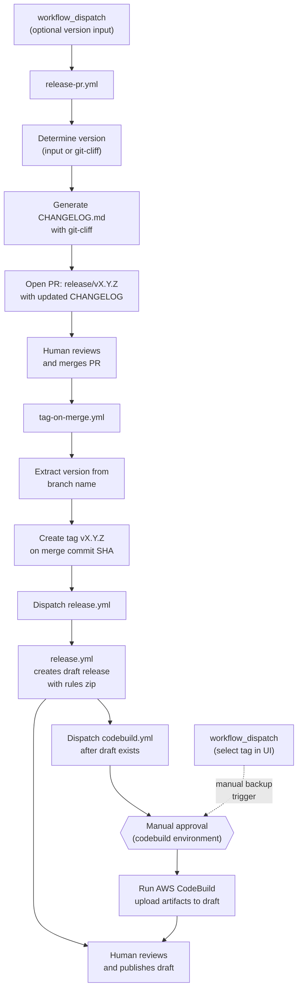
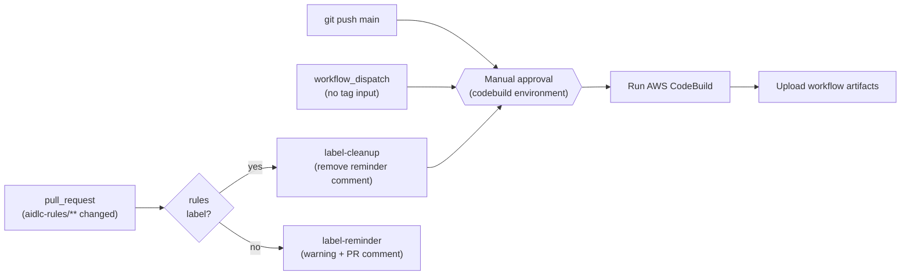
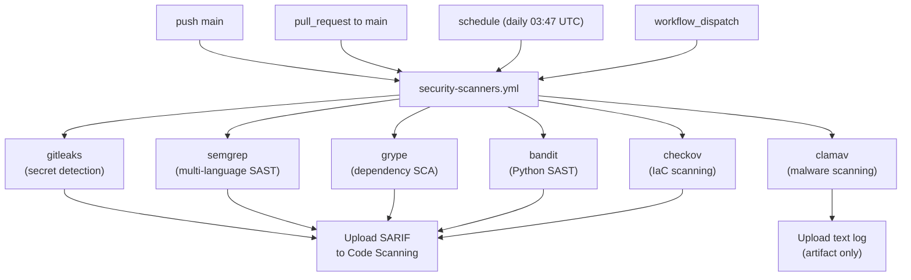
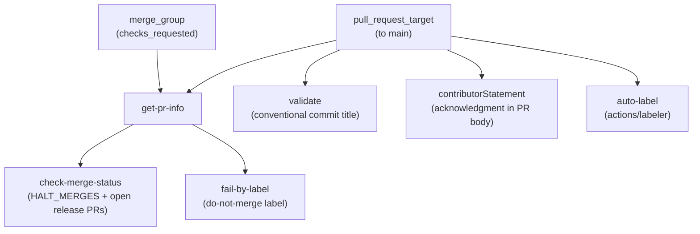

# 운영 가이드 (Administrative Guide)

이 가이드는 `awslabs/aidlc-workflows` 저장소의 CI/CD 인프라, GitHub Workflows, 보호된 환경(protected environments), 시크릿, 변수, 권한, 릴리스 프로세스를 문서화합니다.

**대상 독자:** 저장소 관리자(administrator), 메인테이너(maintainer), 그리고 이 저장소에서 작업하는 AI 코딩 에이전트.

**관련 문서:**

- [Developer's Guide](DEVELOPERS_GUIDE.md) — 로컬에서 빌드 실행 (CodeBuild + `act`)
- [Contributing Guidelines](../CONTRIBUTING.md) — 기여 프로세스 및 컨벤션
- [README](../README.md) — 사용자 대상 설치 및 사용법

---

## 목차

- [Repository Overview](#repository-overview)
- [CI/CD Architecture](#cicd-architecture)
- [Workflow Reference](#workflow-reference)
  - [Release PR Workflow](#release-pr-workflow-release-pryml)
  - [Tag Release Workflow](#tag-release-workflow-tag-on-mergeyml)
  - [CodeBuild Workflow](#codebuild-workflow-codebuildyml)
  - [Release Workflow](#release-workflow-releaseyml)
  - [Pull Request Validation Workflow](#pull-request-validation-workflow-pull-request-lintyml)
  - [Security Scanners Workflow](#security-scanners-workflow-security-scannersyml)
- [Protected Environments](#protected-environments)
- [Secrets and Variables](#secrets-and-variables)
- [Permissions Model](#permissions-model)
- [Security Posture](#security-posture)
  - [Security Finding Requirements](#security-finding-requirements)
- [Code Ownership](#code-ownership)
- [Release Process](#release-process)
- [Changelog Configuration](#changelog-configuration)
- [Updating Pinned Versions](#updating-pinned-versions)

---

## Repository Overview

이 저장소는 **AI-DLC(AI-Driven Development Life Cycle)** 방법론을 `aidlc-rules/` 하위의 마크다운 룰 파일 집합으로 배포합니다. CI/CD 인프라가 담당하는 역할은 다음과 같습니다.

- AWS CodeBuild 기반 **지속적 통합(Continuous integration)** (평가 및 리포팅)
- GitHub Releases를 통한 **릴리스 배포** (zip으로 묶인 룰 파일)
- git-cliff 기반 **체인지로그 생성** (changelog-first 방식 — 릴리스 전에 업데이트되어 태그된 커밋에 포함됨)

```text
awslabs/aidlc-workflows/
├── .github/
│   ├── CODEOWNERS
│   ├── ISSUE_TEMPLATE/           # 버그, 기능, RFC, 문서 템플릿
│   ├── labeler.yml               # 자동 레이블링 룰 (path → label 매핑)
│   ├── pull_request_template.md  # 기여자 동의문(contributor statement)이 포함된 PR 템플릿
│   └── workflows/
│       ├── codebuild.yml         # AWS CodeBuild 기반 CI
│       ├── pull-request-lint.yml # PR 검증 (제목, 레이블, 머지 게이트)
│       ├── release.yml           # 태그 푸시 시 GitHub Release 생성
│       ├── release-pr.yml        # 릴리스 전 체인지로그 PR
│       ├── security-scanners.yml # 보안 스캐닝 스위트 (6개 스캐너)
│       └── tag-on-merge.yml      # 릴리스 PR 머지 시 자동 태깅
├── .claude/
│   └── settings.json             # 공유 Claude Code 프로젝트 설정
├── aidlc-rules/                  # 배포 대상 산출물
│   ├── aws-aidlc-rules/          # 핵심 워크플로우 룰
│   └── aws-aidlc-rule-details/   # 단계별 상세 룰
├── cliff.toml                    # git-cliff 체인지로그 설정
├── docs/
│   ├── ADMINISTRATIVE_GUIDE.md   # 이 파일
│   └── DEVELOPERS_GUIDE.md       # 로컬 빌드 안내
└── scripts/
    └── aidlc-evaluator/          # 평가 프레임워크 (개발 중)
```

---

## CI/CD Architecture

여섯 개의 워크플로우가 두 개의 별개 파이프라인, 보안 스캐닝 스위트, 그리고 풀 리퀘스트 검증 게이트를 구성합니다.

### Pipeline 1: Release (changelog-first)



릴리스 플로우는 **changelog-first** 방식입니다. 즉, CHANGELOG가 태그 생성 *이전에* 업데이트되어 태그된 커밋이 항상 자신의 체인지로그 엔트리를 포함하게 됩니다. 이 플로우에는 세 번의 사람 개입 시점이 있습니다.

1. **릴리스 PR 머지** — 체인지로그를 리뷰하고 자동 태깅을 트리거
2. **CodeBuild 환경 승인** — 빌드를 위한 AWS 자격 증명 접근을 게이팅
3. **드래프트 릴리스 게시(publish)** — 아티팩트를 검토하고 릴리스를 공개

`tag-on-merge.yml`은 태그 생성 후 `gh workflow run --ref vX.Y.Z`를 통해 `release.yml`과 `codebuild.yml`을 명시적으로 디스패치합니다. 디스패치는 **순차적**입니다. `release.yml`이 먼저 실행되며 완료까지 워치(watch)되므로 `codebuild.yml`이 아티팩트를 업로드하기 전에 드래프트 릴리스가 존재함이 보장됩니다. 이는 `GITHUB_TOKEN`으로 생성된 태그가 `on: push: tags` 이벤트를 트리거하지 않기 때문에 필요합니다 — 하지만 `workflow_dispatch`는 이 제한에서 면제됩니다. 두 워크플로우 모두 수동 태그 푸시에 대한 폴백(fallback)으로 `push: tags: v*`도 유지합니다. `codebuild.yml` 워크플로우는 빌드가 진행되기 전에 `codebuild` 보호 환경을 통한 **수동 승인**을 요구합니다. 업로드 단계는 모든 릴리스 상태를 견고하게 처리합니다.

- **Draft exists** (정상 케이스) — `release.yml`이 약 30초 만에 드래프트를 생성하며, CodeBuild는 수 분이 걸리므로 아티팩트가 업로드될 시점에는 드래프트가 준비되어 있습니다
- **No release yet** (codebuild가 먼저 끝난 경우) — 빌드 아티팩트로 드래프트를 생성하며, `release.yml`이 이후에 이를 업데이트합니다
- **Already published** (재실행) — 아티팩트 교체를 시도하며, 불변(immutable) 상태이면 경고와 함께 우아하게 진행합니다

**백업 전략:** 태그 트리거 CodeBuild 실행이 실패하거나 차단된 경우, 관리자가 `workflow_dispatch`를 통해 수동으로 워크플로우를 디스패치하고 GitHub UI의 브랜치/태그 셀렉터에서 `v*` 태그를 선택할 수 있습니다. `github.ref`가 선택된 태그로 해석되므로 업로드 단계가 자동으로 활성화됩니다.

### Pipeline 2: Continuous Integration



### Pipeline 3: Security Scanning



여섯 개의 스캐너 잡(job)이 모두 병렬로 실행됩니다. ClamAV를 제외한 각 스캐너는 SARIF 리포트를 생성하여 GitHub Code Scanning(Security 탭)과 다운로드 가능한 워크플로우 아티팩트 양쪽에 업로드합니다. 모든 스캐너는 **deferred-failure 패턴**을 사용합니다. 스캔이 끝까지 실행되고 결과가 항상 업로드된 뒤에야 발견된 이슈가 설정된 임계값을 초과할 때 잡이 실패합니다. 자세한 내용은 [Security Scanners Workflow](#security-scanners-workflow-security-scannersyml) 레퍼런스를 참고하세요.

### Pipeline 4: Pull Request Validation



`pull-request-lint.yml`은 `main`을 타겟으로 하는 모든 PR과 머지 큐(merge queue) 체크에서 실행됩니다. 네 개의 게이트(컨벤셔널 커밋 PR 제목, PR 템플릿의 기여자 동의문, 설정 가능한 머지 차단 메커니즘, do-not-merge 레이블 체크)를 강제하고 변경된 파일 경로를 기준으로 레이블을 자동 적용합니다. 워크플로우는 `pull_request`가 아니라 `pull_request_target`을 사용하므로 베이스 브랜치의 컨텍스트에서 실행됩니다 — PR 코드를 절대 체크아웃하지 않고 `auto-label` 잡이 API에서 파일 경로만 읽는 `actions/labeler`를 사용하기 때문에 안전합니다.

---

## Workflow Reference

### Release PR Workflow (`release-pr.yml`)

| 속성            | 값                                                |
| --------------- | ------------------------------------------------- |
| **File**        | `.github/workflows/release-pr.yml`                |
| **Trigger**     | `workflow_dispatch` (옵션 `version` 입력)         |
| **Environment** | *(없음)*                                          |
| **Runner**      | `ubuntu-latest`                                   |

**목적:** git-cliff를 사용해 컨벤셔널 커밋으로부터 업데이트된 `CHANGELOG.md`를 생성하고, 릴리스 버전을 `aidlc-rules/VERSION`에 기록하며, `release/vX.Y.Z` 브랜치로 PR을 엽니다. changelog-first 릴리스 플로우의 첫 단계입니다. `aidlc-rules/VERSION` 업데이트는 PR이 `aidlc-rules/`를 건드리도록 보장하여 `codebuild.yml`의 path 필터와 `rules` 자동 레이블링을 트리거합니다.

**Job: `release-pr` ("Create Release PR")**

| 단계 | 이름                     | 동작                                                                                                                                                                                  |
| ---- | ------------------------ | ------------------------------------------------------------------------------------------------------------------------------------------------------------------------------------- |
| 1    | Checkout code            | `fetch-depth: 0`(git-cliff용 전체 히스토리)으로 `actions/checkout` 실행                                                                                                               |
| 2    | Install git-cliff        | CLI 사용을 위해 `orhun/git-cliff-action` 설치                                                                                                                                         |
| 3    | Determine version        | `inputs.version` 사용(semver 검증 포함) 또는 `git-cliff --bumped-version`으로 자동 감지. 둘 다 실패 시 최신 태그에서 patch bump로 폴백                                                |
| 4    | Check tag does not exist | 대상 태그가 이미 존재하면 조기에 실패                                                                                                                                                 |
| 5    | Generate changelog       | `--tag vX.Y.Z` 옵션과 함께 `orhun/git-cliff-action`을 실행하여 `CHANGELOG.md` 생성                                                                                                    |
| 6    | Create release PR        | 버전을 `aidlc-rules/VERSION`에 기록, 브랜치가 이미 존재하지 않는지 확인, 커밋, `release/vX.Y.Z` 브랜치 푸시, PR 오픈(`release`와 `rules` 레이블이 저장소에 존재하면 적용)              |

**버전 감지:** 버전이 지정되면 유효한 semver(`MAJOR.MINOR.PATCH`)여야 합니다. `v0.2.0`과 `0.2.0` 모두 허용됩니다. 버전이 지정되지 않으면 `git-cliff --bumped-version`이 컨벤셔널 커밋 prefix에서 다음 버전을 결정합니다. `cliff.toml`의 `[bump]` 설정이 룰을 제어합니다(예: `feat` → minor bump, breaking change → major bump). 컨벤셔널 커밋이 없으면 워크플로우는 최신 태그에서 patch bump로 폴백합니다. 태그 자체가 전혀 없으면 경고와 함께 정상 종료합니다(PR이 생성되지 않음).

**외부 액션 (SHA-pinned):**

| Action                   | Version | SHA                                        |
| ------------------------ | ------- | ------------------------------------------ |
| `actions/checkout`       | v6.0.1  | `8e8c483db84b4bee98b60c0593521ed34d9990e8` |
| `orhun/git-cliff-action` | v4.7.0  | `e16f179f0be49ecdfe63753837f20b9531642772` |

---

### Tag Release Workflow (`tag-on-merge.yml`)

| 속성            | 값                                                       |
| --------------- | -------------------------------------------------------- |
| **File**        | `.github/workflows/tag-on-merge.yml`                     |
| **Trigger**     | `pull_request: types: [closed]`                          |
| **Condition**   | PR이 머지되었고 브랜치 이름이 `release/v`로 시작할 때    |
| **Environment** | *(없음)*                                                 |
| **Runner**      | `ubuntu-latest`                                          |

**목적:** 릴리스 PR이 머지되면 머지 커밋에 버전 태그를 자동으로 생성한 뒤, `release.yml`을 디스패치(완료까지 대기)하고 이어서 `codebuild.yml`을 디스패치합니다.

**Job: `tag` ("Create Release Tag")**

| 단계 | 이름                               | 동작                                                                                          |
| ---- | ---------------------------------- | --------------------------------------------------------------------------------------------- |
| 1    | Create tag                         | 브랜치 이름에서 버전 추출, 태그 존재 여부 확인, GitHub API로 생성                             |
| 2    | Dispatch release workflow and wait | `gh workflow run release.yml --ref $TAG --repo $REPO` 실행 후 `gh run watch`로 완료까지 대기  |
| 3    | Dispatch codebuild workflow        | `gh workflow run codebuild.yml --ref $TAG --repo $REPO` (드래프트 릴리스가 존재한 뒤 실행됨)  |

**태그 생성:** `gh api repos/.../git/refs`를 사용해 lightweight 태그를 만듭니다.

**Workflow dispatch:** `GITHUB_TOKEN`으로 만든 태그는 다른 워크플로우에서 `on: push: tags` 이벤트를 트리거하지 않습니다. 이를 우회하기 위해 `tag-on-merge.yml`은 `gh workflow run --ref $TAG`로 `release.yml`과 `codebuild.yml`을 명시적으로 디스패치합니다. `workflow_dispatch` 이벤트는 이 `GITHUB_TOKEN` 제한에서 면제됩니다. `--ref`가 태그로 설정되므로 디스패치된 두 워크플로우 모두 `github.ref = refs/tags/vX.Y.Z`를 보게 되며, 이는 실제 태그 푸시와 동일합니다. 디스패치는 **순차적**입니다. `release.yml`이 먼저 실행되고(`gh run watch`로 워치) 드래프트 릴리스가 존재함을 보장한 뒤에 `codebuild.yml`이 아티팩트 업로드를 시도합니다. 릴리스 실행을 찾을 수 없거나 실패하더라도 `codebuild.yml`은 폴백으로 어쨌든 디스패치됩니다.

**보안:** 커맨드 인젝션을 막기 위해 브랜치 이름 `release/vX.Y.Z`는 직접 보간되지 않고 환경 변수를 통해 전달됩니다. 잡 레벨 `if` 조건은 `github.event.pull_request.merged == true`를 사용하여 머지된 PR만 태깅을 트리거하도록 보장합니다.

---

### CodeBuild Workflow (`codebuild.yml`)

| 속성            | 값                                                                                                                                                                                                                            |
| --------------- | ----------------------------------------------------------------------------------------------------------------------------------------------------------------------------------------------------------------------------- |
| **File**        | `.github/workflows/codebuild.yml`                                                                                                                                                                                             |
| **Triggers**    | `main`으로의 `push`, `v*` 태그 `push`, `main`을 타겟으로 하는 `pull_request`(레이블 게이팅, path 필터링), `workflow_dispatch`(`tag-on-merge.yml`이 디스패치하거나 수동 — UI에서 태그를 선택하면 릴리스 빌드를 트리거)          |
| **Environment** | `codebuild` (보호됨, 수동 승인)                                                                                                                                                                                               |
| **Runner**      | `ubuntu-latest`                                                                                                                                                                                                               |
| **Concurrency** | `{workflow}-{event_name}-{ref}`로 그룹핑, 진행 중인 실행은 취소                                                                                                                                                               |

**목적:** AWS CodeBuild 프로젝트를 실행하고, primary 및 secondary 아티팩트를 S3에서 다운로드하여 GitHub Actions 캐시에 캐싱하고, 워크플로우 아티팩트로 업로드합니다. `v*` 태그에서 트리거된 경우에는 GitHub Release에 이를 첨부합니다.

**PR 레이블 게이트:** `pull_request` 이벤트의 경우 워크플로우는 `aidlc-rules/**` 아래의 파일이 변경된 경우(`paths` 필터)에만 실행되며, `build` 잡은 PR에 `rules` 레이블이 있을 때만(`contains(github.event.pull_request.labels.*.name, 'rules')`) 실행됩니다. `rules` 레이블은 `pull-request-lint.yml`의 `auto-label` 잡에 의해 자동 적용됩니다([Pull Request Validation Workflow](#pull-request-validation-workflow-pull-request-lintyml) 참고). 트리거는 `types: [opened, synchronize, reopened, labeled]`를 포함하므로 레이블이 붙은 PR로의 후속 푸시가 빌드를 자동 재트리거합니다. `push`, `workflow_dispatch`, 태그 이벤트는 레이블 체크를 완전히 우회합니다.

**Job: `label-reminder`** (PR 전용, `rules` 레이블 없음)

| 단계 | 이름                             | 동작                                                                                       |
| ---- | -------------------------------- | ------------------------------------------------------------------------------------------ |
| 1    | Warn about missing rules label   | Actions 서머리에서 보이는 `::warning::` 어노테이션을 발행                                  |
| 2    | Comment on PR                    | 1회성 PR 코멘트 작성(멱등 — 리마인더 코멘트가 이미 존재하면 건너뜀)                        |

이 잡은 `aidlc-rules/**`가 변경되었지만 `rules` 레이블이 없는 `pull_request` 이벤트에 대해서만 실행됩니다. 메인테이너와 리뷰어에게 평가 파이프라인이 트리거되지 않았음을 알립니다. 중복을 피하기 위해 HTML 코멘트 마커(`<!-- rules-label-reminder -->`)를 사용하여 PR당 한 번만 코멘트가 게시됩니다. 정상 운영에서는 `pull-request-lint.yml`의 `auto-label` 잡이 `rules` 레이블을 자동 적용하므로 이 잡은 폴백 안전망 역할을 합니다.

**Job: `label-cleanup`** (PR 전용, `rules` 레이블 존재)

| 단계 | 이름                          | 동작                                                                                       |
| ---- | ----------------------------- | ------------------------------------------------------------------------------------------ |
| 1    | Remove label reminder comment | `label-reminder` PR 코멘트를 찾아 삭제(존재하지 않으면 no-op)                              |

이 잡은 `rules` 레이블이 적용되면 실행되어 `codebuild` 환경 승인 게이트를 기다리지 않고 즉시 리마인더 코멘트를 제거합니다.

**Job: `build`**

| 단계 | 이름                         | 조건                       | 동작                                                                |
| ---- | ---------------------------- | -------------------------- | ------------------------------------------------------------------- |
| 1    | List caches                  | *(항상)*                   | 기존 프로젝트 캐시에 대해 `gh cache list` 실행                      |
| 2    | Check cache                  | *(항상)*                   | `lookup-only: true`로 `actions/cache/restore`                       |
| 3    | Configure AWS credentials    | 캐시 미스                  | `aws-actions/configure-aws-credentials` (OIDC)                      |
| 4    | Run CodeBuild                | 캐시 미스                  | 인라인 buildspec으로 `aws-actions/aws-codebuild-run-build`          |
| 5    | Build ID                     | 캐시 미스 (항상)           | CodeBuild 빌드 ID 출력                                              |
| 6    | Download CodeBuild artifacts | 캐시 미스                  | S3에서 primary + secondary 아티팩트 다운로드                        |
| 7    | List CodeBuild artifacts     | 캐시 미스                  | 다운로드한 zip 파일을 나열 및 검사                                  |
| 8    | Clean old report caches      | 캐시 미스                  | 브랜치에 매칭되는 가장 오래된 캐시 3개 삭제                         |
| 9    | Save report to cache         | 캐시 미스                  | 키 `{project}-{branch}-{sha}`로 `actions/cache/save`                |
| 10   | Upload primary artifact      | `!env.ACT`                 | `{project}.zip`을 `actions/upload-artifact`                         |
| 11   | Upload evaluation artifact   | `!env.ACT`                 | `evaluation.zip`을 `actions/upload-artifact`                        |
| 12   | Upload trend artifact        | `!env.ACT`                 | `trend.zip`을 `actions/upload-artifact`                             |
| 13   | Upload artifacts to release  | `v*` 태그에서 트리거된 경우 | 빌드 아티팩트를 GitHub Release에 첨부(드래프트 또는 게시됨)         |

**캐싱 전략:** 캐시 키 `{project}-{branch}-{sha}`는 동일한 브랜치의 동일한 커밋이 두 번 빌드되지 않도록 보장합니다. 캐시 히트 시 3~9 단계는 완전히 건너뜁니다.

**인라인 buildspec:** 워크플로우는 외부 파일을 참조하는 대신 전체 `buildspec-override`를 임베드합니다. buildspec은 다음을 수행합니다.

- `gh` CLI(dnf 경유)와 `uv`(Python 패키지 매니저)를 설치
- 빌드 컨텍스트를 결정: release(태그됨), pre-release(기본 브랜치), pre-merge(피처 브랜치)
- `.codebuild/` 아래에 플레이스홀더 evaluation 및 trend 리포트 파일 생성
- primary 아티팩트(`.codebuild/` 아래 모든 파일)와 두 개의 secondary 아티팩트(`evaluation`, `trend`)를 출력

**아티팩트 업로드 호환성:** 업로드 단계는 `!env.ACT`로 게이팅됩니다. `actions/upload-artifact` v6이 [`act`](https://github.com/nektos/act) 로컬 러너와 호환되지 않기 때문입니다.

**외부 액션 (모두 SHA-pinned):**

| Action                                  | Version | SHA                                        |
| --------------------------------------- | ------- | ------------------------------------------ |
| `actions/cache/restore`                 | v5.0.3  | `cdf6c1fa76f9f475f3d7449005a359c84ca0f306` |
| `aws-actions/configure-aws-credentials` | v6.0.0  | `8df5847569e6427dd6c4fb1cf565c83acfa8afa7` |
| `aws-actions/aws-codebuild-run-build`   | v1.0.18 | `d8279f349f3b1b84e834c30e47c20dcb8888b7e5` |
| `actions/cache/save`                    | v5.0.3  | `cdf6c1fa76f9f475f3d7449005a359c84ca0f306` |
| `actions/upload-artifact`               | v6.0.0  | `b7c566a772e6b6bfb58ed0dc250532a479d7789f` |

---

### Release Workflow (`release.yml`)

| 속성            | 값                                                                                                                              |
| --------------- | ------------------------------------------------------------------------------------------------------------------------------- |
| **File**        | `.github/workflows/release.yml`                                                                                                 |
| **Triggers**    | `workflow_dispatch`(`tag-on-merge.yml`이 디스패치), `v*`에 매칭되는 태그의 `push`(수동 태그 푸시에 대한 폴백)                    |
| **Environment** | *(없음)*                                                                                                                        |
| **Runner**      | `ubuntu-latest`                                                                                                                 |

**목적:** 디스패치되거나 버전 태그가 푸시되면 `aidlc-rules/`를 zip으로 묶은 **드래프트** GitHub Release를 생성합니다. CodeBuild 아티팩트를 첨부하고 게시 전에 검토할 수 있도록 드래프트 상태로 유지됩니다.

**Job: `release` ("Create Release")**

| 단계 | 이름                    | 조건               | 동작                                                                                                                                                            |
| ---- | ----------------------- | ------------------ | --------------------------------------------------------------------------------------------------------------------------------------------------------------- |
| 1    | Checkout code           | *(항상)*           | `fetch-depth: 0`으로 `actions/checkout`                                                                                                                         |
| 2    | Extract version         | *(항상)*           | 가드: `GITHUB_REF`가 `v*` 태그가 아니면 `::warning::`을 발행하고 남은 단계를 건너뜀. 그렇지 않으면 `version`(접두사 `v` 제외)과 `tag`(`v` 포함)로 파싱           |
| 3    | Create release artifact | ref가 `v*` 태그    | `zip -r ai-dlc-rules-v{VERSION}.zip aidlc-rules/`                                                                                                               |
| 4    | Create GitHub Release   | ref가 `v*` 태그    | `draft: true`와 zip 첨부로 `softprops/action-gh-release`                                                                                                        |

**우아한 스킵(Graceful skip):** 태그가 아닌 브랜치에서 디스패치된 경우(예: 누군가 `main`에서 워크플로우를 수동으로 실행) 잡은 실패가 아니라 경고 어노테이션과 함께 정상 완료합니다. 이는 Actions UI에서 혼란스러운 빨간 X 실패를 방지합니다.

**릴리스 네이밍:** `AI-DLC Workflow v{VERSION}` (예: `AI-DLC Workflow v0.1.6`)

**외부 액션 (SHA-pinned):**

| Action                        | Version | SHA                                        |
| ----------------------------- | ------- | ------------------------------------------ |
| `actions/checkout`            | v6.0.1  | `8e8c483db84b4bee98b60c0593521ed34d9990e8` |
| `softprops/action-gh-release` | v2.5.0  | `a06a81a03ee405af7f2048a818ed3f03bbf83c7b` |

---

### Pull Request Validation Workflow (`pull-request-lint.yml`)

| 속성            | 값                                                                                                                                                |
| --------------- | ------------------------------------------------------------------------------------------------------------------------------------------------- |
| **File**        | `.github/workflows/pull-request-lint.yml`                                                                                                         |
| **Triggers**    | `main`을 타겟으로 하는 `pull_request_target`(edited, labeled, opened, ready_for_review, reopened, synchronize, unlabeled); `merge_group`(checks_requested) |
| **Environment** | *(없음)*                                                                                                                                          |
| **Runner**      | `ubuntu-latest`                                                                                                                                   |
| **Concurrency** | `{workflow}-{event_name}-{ref}`로 그룹핑, 진행 중인 실행은 취소                                                                                   |

**목적:** 머지 전 풀 리퀘스트를 검증합니다. 컨벤셔널 커밋 PR 제목, 기여자 동의문, 머지 차단 컨트롤, do-not-merge 레이블 게이트를 강제합니다. 머지 큐 체크로도 실행됩니다.

**`pull_request_target`을 사용하는 이유:** 이 트리거는 PR head가 아니라 베이스 브랜치의 컨텍스트에서 워크플로우를 실행합니다. 어떤 단계도 PR 코드를 체크아웃하거나 실행하지 않기 때문에 안전합니다 — 워크플로우는 PR 메타데이터(제목, 레이블, 본문)만 검사합니다. `pull_request_target`을 사용함으로써 fork에서 온 PR에 대해서도 저장소 시크릿과 레이블에 접근할 수 있습니다.

**Job: `get-pr-info`**

| 단계 | 이름        | 동작                                                                                                       |
| ---- | ----------- | ---------------------------------------------------------------------------------------------------------- |
| 1    | Get PR info | 이벤트 컨텍스트(`pull_request_target`) 또는 API 조회(`merge_group`)에서 PR 번호와 레이블 추출              |

다운스트림 잡을 위한 `pr_number`와 `pr_labels`를 출력합니다. `merge_group` 이벤트의 경우 PR 번호는 ref 이름에서 추출되며 레이블은 GitHub API로 가져옵니다. `pull_request_target` 이벤트의 경우 값은 이벤트 페이로드에서 직접 가져옵니다.

**Job: `check-merge-status` ("Check Merge Status")**

`get-pr-info`에 의존합니다. 업스트림 잡이 실패해도 실행되도록 `if: always()`로 실행됩니다.

| 체크                 | 동작                                                                                |
| -------------------- | ----------------------------------------------------------------------------------- |
| Open release PRs     | 다른 `release/` PR이 열려 있으면 머지를 차단(동시 릴리스 방지)                      |
| `HALT_MERGES = 0`    | 모든 머지 허용 (기본값)                                                             |
| `HALT_MERGES = -N`   | 모든 머지 차단                                                                      |
| `HALT_MERGES = N`    | PR #N만 머지 허용                                                                   |

**Job: `fail-by-label` ("Fail by Label")**

`get-pr-info`에 의존합니다. `if: always()`로 실행됩니다. PR에 `do-not-merge` 레이블(`DO_NOT_MERGE_LABEL` 변수로 설정 가능)이 있으면 체크를 실패시킵니다.

**Job: `validate` ("Validate PR title")**

`pull_request`와 `pull_request_target` 이벤트에서만 실행됩니다(`merge_group`은 제외). PR 제목에 컨벤셔널 커밋 형식을 강제하기 위해 `amannn/action-semantic-pull-request`를 사용합니다.

허용 타입: `fix`, `feat`, `build`, `chore`, `ci`, `docs`, `style`, `refactor`, `perf`, `test`. 스코프는 선택 사항(`requireScope: false`).

**Job: `auto-label` ("Auto-label")**

`pull_request_target` 이벤트에서만 실행됩니다. [`actions/labeler`](https://github.com/actions/labeler) v6.0.1을 사용하여 변경된 파일 경로에 따라 레이블을 자동으로 적용 및 제거합니다. 레이블 룰은 `.github/labeler.yml`에 정의됩니다.

| 레이블          | Path 패턴                                       | 설명                                              |
| --------------- | ----------------------------------------------- | ------------------------------------------------- |
| `rules`         | `aidlc-rules/**`                                | CodeBuild 평가 파이프라인 트리거                  |
| `documentation` | `**/*.md` (`aidlc-rules/**` 제외)               | rules 외 마크다운 파일 변경                       |
| `github`        | `.github/**`                                    | 워크플로우, 템플릿, 설정 변경                     |

`sync-labels: true`로 설정되어 있으므로 매칭되는 파일이 더 이상 PR diff에 없을 때(예: 리베이스로 해당 변경이 제거된 경우) 레이블이 자동으로 제거됩니다. 새 레이블 룰은 `.github/labeler.yml`을 편집해 추가할 수 있습니다 — 워크플로우 변경은 필요하지 않습니다.

**Job: `contributorStatement` ("Require Contributor Statement")**

`pull_request`와 `pull_request_target` 이벤트에서만 실행됩니다. 봇 계정(`dependabot[bot]`, `github-actions[bot]`, `github-actions`, `aidlc-workflows`)에 대해서는 건너뜁니다. PR 본문이 `.github/pull_request_template.md`의 기여자 동의문을 포함하는지 검증합니다.

> By submitting this pull request, I confirm that you can use, modify, copy, and redistribute this contribution, under the terms of the project license.

**외부 액션 (SHA-pinned):**

| Action                                  | Version | SHA                                        |
| --------------------------------------- | ------- | ------------------------------------------ |
| `actions/labeler`                       | v6.0.1  | `634933edcd8ababfe52f92936142cc22ac488b1b` |
| `amannn/action-semantic-pull-request`   | v6.1.1  | `48f256284bd46cdaab1048c3721360e808335d50` |
| `actions/github-script`                 | v8.0.0  | `ed597411d8f924073f98dfc5c65a23a2325f34cd` |

---

### Security Scanners Workflow (`security-scanners.yml`)

| 속성            | 값                                                                                                  |
| --------------- | --------------------------------------------------------------------------------------------------- |
| **File**        | `.github/workflows/security-scanners.yml`                                                           |
| **Triggers**    | `main`으로의 `push`, `main`을 타겟으로 하는 `pull_request`, `schedule`(매일 03:47 UTC), `workflow_dispatch` |
| **Environment** | *(없음)*                                                                                            |
| **Runner**      | `ubuntu-latest`                                                                                     |
| **Concurrency** | `{workflow}-{event_name}-{ref}`로 그룹핑, 진행 중인 실행은 취소                                     |

**목적:** 시크릿, 취약점, 잘못된 설정, 멀웨어를 탐지하기 위해 여섯 개의 독립 보안 스캐너를 병렬로 실행합니다. 모든 HIGH 및 CRITICAL 발견 사항은 머지 전에 시정 조치되거나 문서화된 위험 수용(risk acceptance)이 있어야 합니다([Security Finding Requirements](#security-finding-requirements) 참고).

**Permissions 모델:** 워크플로우 레벨에서 모두 거부(deny-all)하고, 각 잡에서 `actions: read`, `contents: read`, `security-events: write`만 부여합니다.

**잡:**

| Job        | Scanner  | 무엇을 탐지하는가                                   | 무엇으로 실패하는가                                              |
| ---------- | -------- | --------------------------------------------------- | ---------------------------------------------------------------- |
| `gitleaks` | Gitleaks | git 히스토리의 시크릿                               | `.gitleaks-baseline.json`에 없는 시크릿                          |
| `semgrep`  | Semgrep  | 보안 안티패턴 (모든 언어)                           | 모든 발견 (PR: `--baseline-commit`을 통해 새 발견만)             |
| `grype`    | Grype    | 의존성의 알려진 CVE                                 | high 또는 critical CVE (`fail-on-severity: high`)                |
| `bandit`   | Bandit   | Python 보안 이슈                                    | high confidence를 가진 모든 발견                                 |
| `checkov`  | Checkov  | IaC 설정 오류 (GitHub Actions, Dockerfile)          | 모든 체크 실패 (skip된 체크 제외)                                |
| `clamav`   | ClamAV   | 멀웨어 및 바이러스                                  | 모든 탐지                                                        |

**Deferred-failure 패턴:** 모든 스캐너는 단계를 실패시키지 않고 종료 코드를 캡처하며(`set +e`), SARIF 리포트를 아티팩트와 GitHub Code Scanning에 업로드한 뒤 발견 사항이 있을 때 잡을 실패시킵니다. 이는 결과가 항상 보존되도록 보장합니다. ClamAV는 동일한 패턴을 따르지만 SARIF 대신 텍스트 로그를 업로드합니다.

**설정 파일:**

| 파일                      | 용도                                                |
| ------------------------- | --------------------------------------------------- |
| `.bandit`                 | Bandit 대상, 제외, confidence 레벨                  |
| `.semgrepignore`          | Semgrep 경로 제외                                   |
| `.gitleaks.toml`          | Gitleaks 룰셋 확장 및 경로 허용리스트               |
| `.gitleaks-baseline.json` | 기존에 알려진 발견(테스트 자격 증명)                |
| `.grype.yaml`             | Grype 심각도 임계값 및 CVE 무시 리스트              |
| `.checkov.yaml`           | Checkov 프레임워크 및 건너뛴 체크                   |

**버전 고정(Version pinning):** 모든 스캐너 도구 버전과 GitHub Actions는 재현 가능한 빌드와 공급망 공격 방지를 위해 워크플로우 파일에서 특정 버전이나 커밋 SHA로 고정됩니다. 이 고정은 주기적으로(최소 분기마다) 검토 및 업데이트되어야 합니다. 업데이트 절차는 [Updating Pinned Versions](#updating-pinned-versions)를 참고하세요.

스캐너별 자세한 시정 조치 및 억제(suppression) 방법은 [Developer's Guide — Security Scanners](DEVELOPERS_GUIDE.md#security-scanners)를 참고하세요.

---

## Protected Environments

| Environment | 사용자                       | 용도                                              |
| ----------- | --------------------------- | ------------------------------------------------- |
| `codebuild` | `codebuild.yml` `build` 잡  | CodeBuild를 위한 AWS 자격 증명 접근을 게이팅      |

`codebuild` 환경은 유일한 보호 환경입니다. 다음을 포함합니다.

- `AWS_CODEBUILD_ROLE_ARN` 시크릿(OIDC 기반 AWS 역할 가정에 필요)
- 저장소 변수 `CODEBUILD_PROJECT_NAME`, `AWS_REGION`, `ROLE_DURATION_SECONDS`(저장소 레벨에 설정될 수도 있음)

환경 보호 룰(GitHub 저장소 설정에서 구성)에는 필수 리뷰어 또는 디플로이먼트 브랜치 제한이 포함될 수 있습니다.

---

## Secrets and Variables

### Secrets

| Secret                   | 범위                          | 사용자                                                                       | 용도                                                                                                                       |
| ------------------------ | ----------------------------- | ---------------------------------------------------------------------------- | -------------------------------------------------------------------------------------------------------------------------- |
| `AWS_CODEBUILD_ROLE_ARN` | Environment (`codebuild`)     | `codebuild.yml`                                                              | OIDC 기반 AWS STS 역할 가정을 위한 IAM Role ARN                                                                            |
| `GITHUB_TOKEN`           | 자동 (GitHub 제공)            | `release.yml`, `release-pr.yml`, `tag-on-merge.yml`, `pull-request-lint.yml` | GitHub API 호출 인증(릴리스 생성, PR 생성, 태그 생성, 워크플로우 디스패치, PR 검증)                                        |

`codebuild.yml` 워크플로우는 캐시 관리와 릴리스 에셋 업로드에 `github.token`(자동 토큰, `secrets.` 접두사 없이 접근)도 사용합니다.

### Repository Variables

| 변수                      | 사용자                  | 기본 폴백           | 용도                                                                |
| ------------------------- | ----------------------- | ------------------- | ------------------------------------------------------------------- |
| `CODEBUILD_PROJECT_NAME`  | `codebuild.yml`         | `codebuild-project` | AWS CodeBuild 프로젝트 이름                                         |
| `AWS_REGION`              | `codebuild.yml`         | `us-east-1`         | CodeBuild와 STS를 위한 AWS 리전                                     |
| `ROLE_DURATION_SECONDS`   | `codebuild.yml`         | `7200`              | STS 세션 지속 시간(초)                                              |
| `DO_NOT_MERGE_LABEL`      | `pull-request-lint.yml` | `do-not-merge`      | PR 머지를 차단하는 레이블 이름                                      |
| `HALT_MERGES`             | `pull-request-lint.yml` | `0`                 | 머지 게이트: `0` = 전부 허용, `-N` = 전부 차단, `N` = PR #N만 허용  |

모든 변수는 `${{ vars.VAR || 'default' }}` 구문을 통한 합리적인 기본값을 가지므로 명시적인 변수 설정 없이도 워크플로우가 실행됩니다.

---

## Permissions Model

### 워크플로우 레벨 권한

| Workflow                  | Permissions                                |
| ------------------------- | ------------------------------------------ |
| `codebuild.yml`           | 16개 스코프 모두 명시적으로 `none`         |
| `pull-request-lint.yml`   | 16개 스코프 모두 명시적으로 `none`         |
| `release.yml`             | 16개 스코프 모두 명시적으로 `none`         |
| `release-pr.yml`          | 16개 스코프 모두 명시적으로 `none`         |
| `security-scanners.yml`   | 16개 스코프 모두 명시적으로 `none`         |
| `tag-on-merge.yml`        | 16개 스코프 모두 명시적으로 `none`         |

### 잡 레벨 권한 (오버라이드)

| Workflow                | Job                    | Permissions                                               | 근거(Rationale)                                                                                              |
| ----------------------- | ---------------------- | --------------------------------------------------------- | ------------------------------------------------------------------------------------------------------------ |
| `codebuild.yml`         | `label-reminder`       | `pull-requests: write`                                    | `rules` 레이블이 없을 때 리마인더 코멘트 게시                                                                |
| `codebuild.yml`         | `label-cleanup`        | `pull-requests: write`                                    | `rules` 레이블이 적용되면 리마인더 코멘트 삭제                                                               |
| `codebuild.yml`         | `build`                | `actions: write`, `contents: write`, `id-token: write`    | 캐시 관리, 릴리스 에셋 업로드, AWS STS용 OIDC 토큰                                                           |
| `pull-request-lint.yml` | `auto-label`           | `contents: read`, `issues: write`, `pull-requests: write` | 변경된 파일 경로 기반 레이블 적용/제거. `issues: write`는 아직 존재하지 않는 레이블 생성을 허용              |
| `pull-request-lint.yml` | `get-pr-info`          | `contents: read`, `pull-requests: read`                   | API로 PR 메타데이터와 레이블 읽기                                                                            |
| `pull-request-lint.yml` | `check-merge-status`   | `pull-requests: read`                                     | 머지 게이트 체크를 위한 PR 상태 읽기                                                                         |
| `pull-request-lint.yml` | `validate`             | `pull-requests: read`                                     | 컨벤셔널 커밋 검증을 위한 PR 제목 읽기                                                                       |
| `pull-request-lint.yml` | `contributorStatement` | `pull-requests: read`                                     | 기여자 동의 확인을 위한 PR 본문 읽기                                                                         |
| `release.yml`           | `release`              | `contents: write`                                         | 드래프트 릴리스 생성 및 zip 아티팩트 첨부                                                                    |
| `release-pr.yml`        | `release-pr`           | `contents: write`, `pull-requests: write`                 | 체인지로그 생성, 브랜치 푸시, PR 오픈                                                                        |
| `tag-on-merge.yml`      | `tag`                  | `contents: write`, `actions: write`                       | API로 태그 생성, release와 codebuild 워크플로우 디스패치                                                     |

여섯 개의 워크플로우 모두 **deny-all-then-grant** 패턴을 따릅니다. 모든 권한 스코프를 워크플로우 레벨에서 `none`으로 설정한 뒤 잡 레벨에서 필요한 스코프만 부여합니다. 이는 가장 엄격한 구성이며 손상된 단계로부터의 권한 상승을 방지합니다. `security-scanners.yml`은 여섯 개 잡 각각에 `actions: read`, `contents: read`, `security-events: write`를 부여합니다.

---

## Security Posture

| 컨트롤                       | 구현                                                                                                                                                                                                                                              |
| --------------------------- | ------------------------------------------------------------------------------------------------------------------------------------------------------------------------------------------------------------------------------------------------- |
| **공급망 보호**             | 모든 외부 액션을 가변 버전 태그가 아닌 전체 커밋 SHA로 고정                                                                                                                                                                                       |
| **AWS 인증**                | `id-token: write`를 통한 OIDC 기반 역할 가정 — 정적 자격 증명을 저장하지 않음                                                                                                                                                                     |
| **최소 권한 토큰**          | 여섯 개 워크플로우 모두 워크플로우 레벨에서 16개 권한 스코프를 모두 명시적으로 거부하고, 잡 레벨에서 필요한 스코프만 부여                                                                                                                          |
| **환경 보호**               | `codebuild` 환경이 잠재적인 리뷰어/브랜치 룰과 함께 AWS 자격 증명 접근을 게이팅                                                                                                                                                                   |
| **보안 스캐닝**             | `main`으로의 모든 푸시, 모든 PR, 매일 자동으로 여섯 개의 스캐너(SAST, SCA, 시크릿, IaC, 멀웨어)를 실행. 발견 사항은 GitHub Code Scanning에 게시. 모든 HIGH 및 CRITICAL 발견은 시정 조치 또는 문서화된 위험 수용 필요                                |
| **레이블 게이팅 CI**        | `codebuild.yml`은 PR에 `rules` 레이블을 요구하며 `aidlc-rules/**` 변경에 대해서만 트리거되어 불필요한 빌드와 환경 승인 프롬프트를 방지. 레이블은 `pull-request-lint.yml`의 `auto-label` 잡에서 자동 적용                                           |
| **Concurrency 제어**        | `codebuild.yml`, `pull-request-lint.yml`, `security-scanners.yml`은 동일 브랜치의 진행 중인 실행을 취소                                                                                                                                           |
| **안전한 PR 트리거**        | `pull-request-lint.yml`은 `pull_request_target`을 사용하지만 PR 코드를 절대 체크아웃하지 않고 메타데이터(제목, 레이블, 본문)만 검사                                                                                                                |
| **인젝션-안전 입력**        | `run:` 블록에서 `${{ }}` 표현식 보간을 전혀 사용하지 않음 — 모든 동적 값(`github.ref_name`, `github.repository`, `env.*`, 이벤트 입력)은 단계 레벨 `env:` 또는 자동 export되는 워크플로우 `env:` 변수로 전달                                       |
| **코드 소유권**             | `.github/`(워크플로우 포함)는 CODEOWNERS에 의해 `@awslabs/aidlc-admins`가 단독 소유                                                                                                                                                               |
| **계정 마스킹**             | AWS 자격 증명 설정에서 `mask-aws-account-id: true`                                                                                                                                                                                                |

### Security Finding Requirements

스캐너로부터 발견된 모든 **HIGH** 및 **CRITICAL** 보안 이슈는 PR이 `main`에 머지되기 전에 **시정 조치(remediated)** 되거나 **문서화된 위험 수용(documented risk acceptance)** 이 있어야 합니다. 적용 대상은 다음과 같습니다.

- **Bandit / Semgrep (SAST):** High 심각도 코드 발견은 수정되거나 정당화(왜 수용 가능한지 설명)를 포함한 인라인 코멘트(`# nosec` / `# nosemgrep`)로 억제되어야 함
- **Grype (SCA):** High 및 critical CVE는 영향 받는 의존성을 업그레이드하여 해결해야 함. 수정본이 없으면 `.grype.yaml` `ignore`에 CVE, 영향 받는 패키지, 수용 이유와 함께 항목을 추가
- **Gitleaks (Secrets):** 탐지된 모든 시크릿은 즉시 회전(rotate)되어야 함. 합성/테스트 자격 증명만 베이스라인(`.gitleaks-baseline.json`)에 추가 가능
- **Checkov (IaC):** 실패한 체크는 수정되거나 이유와 함께 인라인 `# checkov:skip=` 코멘트로 억제되거나, 코멘트와 함께 `.checkov.yaml` `skip-check`에 추가
- **ClamAV (Malware):** 모든 탐지는 조사되어야 하며 해당 파일은 제거되어야 함. 억제 메커니즘 없음

**위험 수용 프로세스:**

1. 개발자가 명확한 정당화와 함께 적절한 억제(인라인 코멘트 또는 설정 항목)를 추가
2. 억제는 일반적인 PR 코드 리뷰 프로세스의 일부로 검토됨
3. `@awslabs/aidlc-admins` 또는 `@awslabs/aidlc-maintainers` 리뷰어가 모든 위험 수용을 승인해야 함
4. LOW 및 MEDIUM 발견은 가능할 때 해결해야 하지만 머지를 차단하지 않음

스캐너별 자세한 시정 조치 및 억제 방법은 [Developer's Guide — Security Scanners](DEVELOPERS_GUIDE.md#security-scanners)를 참고하세요.

---

## Code Ownership

`.github/CODEOWNERS`에 정의됩니다.

| Path                                          | Owners                                                                        |
| --------------------------------------------- | ----------------------------------------------------------------------------- |
| `*` (default)                                 | `@awslabs/aidlc-admins` `@awslabs/aidlc-maintainers`                          |
| `.github/`                                    | `@awslabs/aidlc-admins`                                                       |
| `.github/CODEOWNERS`                          | `@awslabs/aidlc-admins`                                                       |
| `aidlc-rules/`                                | `@awslabs/aidlc-admins` `@awslabs/aidlc-maintainers` `@awslabs/aidlc-writers` |
| `assets/`                                     | `@awslabs/aidlc-admins` `@awslabs/aidlc-maintainers` `@awslabs/aidlc-writers` |
| `scripts/`                                    | `@awslabs/aidlc-admins` `@awslabs/aidlc-maintainers`                          |
| `CHANGELOG.md`, `cliff.toml`, `LICENSE`, etc. | `@awslabs/aidlc-admins`                                                       |

**핵심 함의:** `.github/`(워크플로우, CODEOWNERS, 이슈 템플릿) 변경은 오직 `@awslabs/aidlc-admins`만 승인 가능합니다.

---

## Release Process

릴리스는 **changelog-first** 플로우를 따릅니다. CHANGELOG가 태그 생성 *이전에* 업데이트되어 태그된 커밋이 항상 자신의 체인지로그 엔트리를 포함합니다. 프로세스에는 세 번의 사람 개입 시점이 있습니다(PR 머지, CodeBuild 승인, 릴리스 게시).

1. **GitHub Actions UI를 통해 Release PR 워크플로우 디스패치:**
   - Actions → Release PR → Run workflow로 이동
   - 선택적으로 버전 지정(예: `0.2.0`); 비워두면 컨벤셔널 커밋에서 자동 결정
   - `release-pr.yml`이 `CHANGELOG.md`를 생성하고, 버전을 `aidlc-rules/VERSION`에 기록하고, `release/v1.2.0` 브랜치에서 `release`와 `rules` 레이블을 단 PR을 엽니다

2. **릴리스 PR 검토 및 머지:**
   - 체인지로그 내용이 올바른지 확인
   - PR을 머지(`CHANGELOG.md`는 `@awslabs/aidlc-admins`가 소유하므로 그들의 승인 필요)
   - `tag-on-merge.yml`이 머지 커밋에 태그 `v1.2.0`을 자동 생성하고 release와 build 워크플로우를 디스패치

3. **`release.yml` 자동 실행** (`tag-on-merge.yml`이 `--ref v1.2.0`으로 디스패치):
   - `aidlc-rules/`를 `ai-dlc-rules-v1.2.0.zip`으로 압축
   - zip이 첨부된 "AI-DLC Workflow v1.2.0" 이름의 **드래프트** GitHub Release 생성

4. **`codebuild.yml` 자동 실행** (`tag-on-merge.yml`이 디스패치; `codebuild` 환경 승인 필요):
   - 태그된 커밋에서 CodeBuild 실행
   - 빌드 아티팩트(primary, evaluation, trend) 다운로드
   - 아티팩트를 드래프트 릴리스에 첨부(아직 없으면 드래프트 생성)

5. **GitHub UI에서 "Publish release"를 클릭하여 릴리스 게시:**
   - 예상되는 모든 아티팩트(룰 zip + 빌드 아티팩트)가 첨부되었는지 확인
   - 릴리스 노트를 검토하고 필요하면 편집

**참고:** 태그 트리거 빌드가 진행되도록 하려면 `codebuild` 보호 환경의 디플로이먼트 브랜치 룰을 `v*` 태그(추가로 `main` 외)도 허용하도록 업데이트해야 할 수 있습니다.

---

## Changelog Configuration

`cliff.toml`(에 정의되며, `release-pr.yml`이 사용):

| 설정              | 값                                                    |
| ----------------- | ----------------------------------------------------- |
| **Commit format** | 컨벤셔널 커밋 (`feat:`, `fix:`, `docs:` 등)           |
| **Tag pattern**   | `v[0-9].*`                                            |
| **Sort order**    | 오래된 순(Oldest first)                               |

**커밋 그룹:**

| Prefix     | 그룹 이름     |
| ---------- | ------------- |
| `feat`     | Features      |
| `fix`      | Bug Fixes     |
| `docs`     | Documentation |
| `perf`     | Performance   |
| `refactor` | Refactoring   |
| `style`    | Style         |
| `test`     | Tests         |
| `build`    | CI/CD         |
| `ci`       | CI/CD         |
| `chore`    | Miscellaneous |

**필터링된 커밋:**

| 패턴                     | 동작                                          |
| ------------------------ | --------------------------------------------- |
| `docs: update changelog` | 건너뜀 (이전 릴리스 플로우의 노이즈)          |

비-컨벤셔널 커밋은 필터링되어 제외됩니다(`filter_unconventional = true`).

**버전 bump 룰** (`[bump]` 섹션에 정의):

| 룰                                  | 효과                                          |
| ----------------------------------- | --------------------------------------------- |
| `features_always_bump_minor = true` | `feat:` 커밋이 minor 버전 bump를 트리거        |
| `breaking_always_bump_major = true` | breaking change가 major 버전 bump를 트리거     |

이 룰들은 `release-pr.yml`에서 다음 버전을 자동 결정할 때 `git-cliff --bumped-version`에 의해 사용됩니다.

---

## Updating Pinned Versions

워크플로우 파일의 모든 스캐너 도구, GitHub Actions, 컨테이너 이미지는 특정 버전 또는 커밋 SHA로 고정되어 있습니다. 이는 공급망 공격을 방지하고 재현 가능한 빌드를 보장하지만, 보안 패치와 새 기능을 따라가기 위해 주기적인 유지 관리가 필요합니다.

고정된 버전은 **최소 분기마다** 검토 및 업데이트되어야 합니다.

<!-- TODO: 고정 버전 업데이트를 위한 단계별 지침 추가:
  - 각 스캐너 도구의 최신 버전 확인 방법 (PyPI, GitHub releases, Docker Hub)
  - GitHub Actions의 커밋 SHA 조회 방법 (gh api repos/OWNER/REPO/git/ref/tags/TAG)
  - Docker 이미지 다이제스트 조회 방법 (docker manifest inspect)
  - 업데이트가 정상 작동하는지 검증하는 방법 (피처 브랜치에서 워크플로우 실행)
  - 스캐너 도구 업그레이드의 breaking change 처리 방법
  - Dependabot 또는 Renovate로 자동화 검토
-->

에이전트 pre-commit 체크리스트 (권장):

- npx markdownlint-cli2 --fix "**/*.md"  # 마크다운 린트 이슈 자동 수정
- npx markdownlint-cli2 "**/*.md"    # 린트 에러가 없는지 검증
- uv run pytest                            # uv 래퍼로 테스트 실행

에이전트는 변경 사항을 커밋하고 푸시하기 전에 위 체크리스트를 실행하고 모든 체크가 통과하는지 확인해야 합니다.
